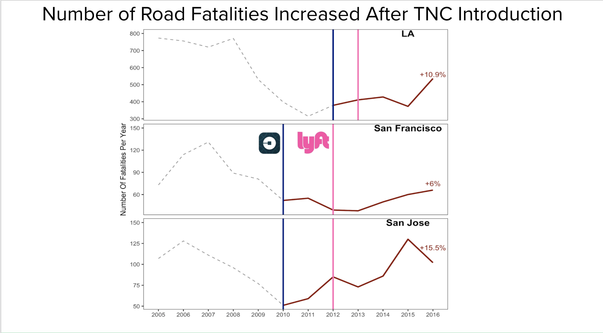
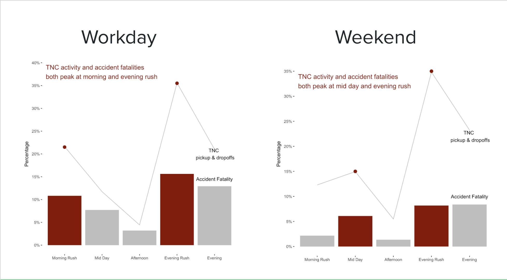
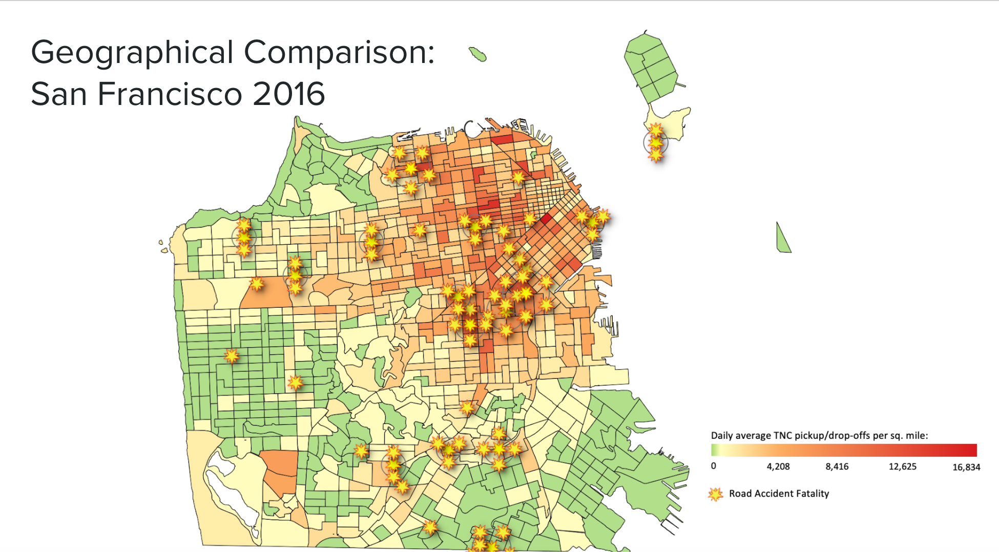
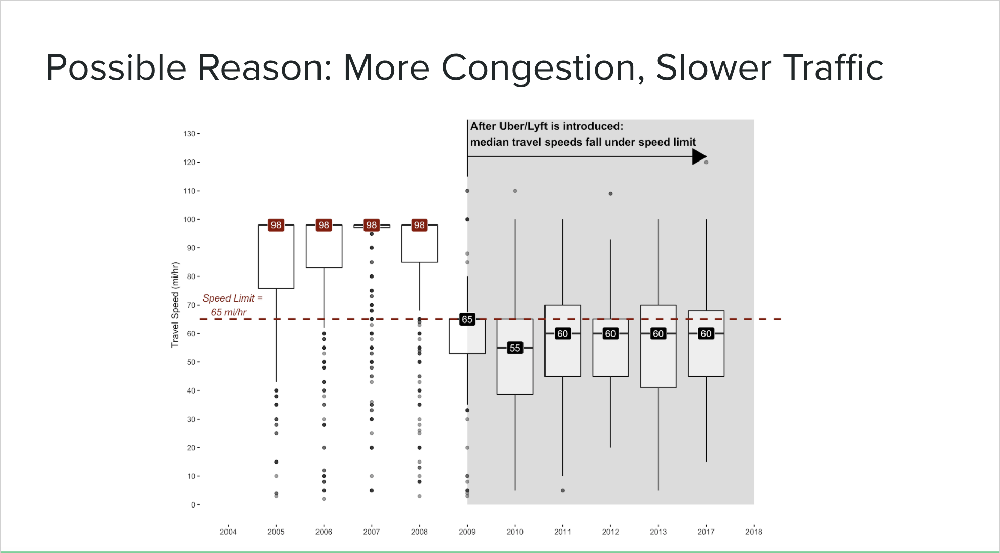
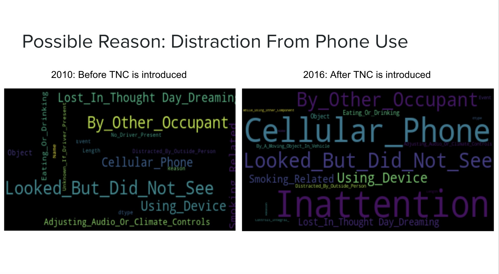

# Does Ridesharing Increase Road Fatalities?
## A look at three major cities in California

## Introduction
San Francisco has one of the lowest car-ownership rates among major American cities. As MSDS students and faculty living in this city, we have come to rely on ridesharing ("Transportation Network Companies”, or “TNCs") as a convenient mode of transportation. We decided to look at traffic and TCN data to investigate the relationship between ridesharing and traffic accidents. We found that in major cities, traffic accidents actually increased in the years after TCNs like Uber and Lyft were introduced.

Our goal is to illustrate the relationship between ridesharing and traffic accidents, focusing on San Francisco, San Jose, and Los Angeles. We plan to show that traffic accidents not only increased overall after TCN adoption, but that peak times for TCN trips mimic trends in peak times for traffic accidents. 

## Data
* <b>Traffic fatality data (2005- 2018):</b> National Highway Traffic Safety Administration 
* <b>Ridesharing (TNC) Activity data (2016): </b> San Francisco County Transportation Authority

## Visualizations
### Looking at annual and day of week trends

### Mapping ridesharing activity and road fatalities

### Possible contributing factors

## Conclusions
From our visualizations, we see the general trend of accident fatalities rising in SF, SJ, and LA after ridesharing was introduced. Fatalities tend to correlate with TNC peak hours, and happen in the areas with the most TNC pick-up and drop-off activity. We also correlate TNC activity with more congestion and slower traffic. We also saw a sharp increase in "Celllular Phone" and "Using Device" as reasons listed by drivers involved in fatality related accidents. 

